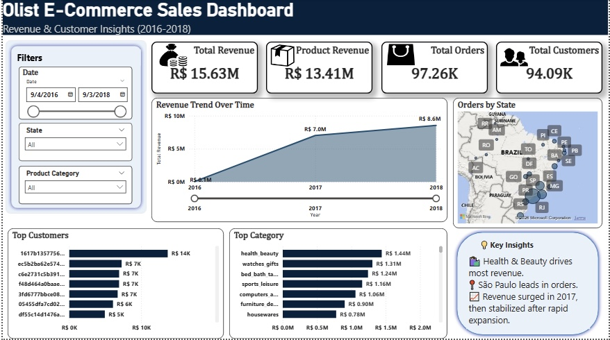

# Olist E-Commerce Data Analysis (SQL + Power BI)

## 📌 Project Overview
This project presents an end-to-end data analysis of the Olist E-commerce dataset using **PostgreSQL** and **Power BI**.

The goal was to transform raw transactional data into meaningful business insights by performing data cleaning, building a structured dataset, and creating an interactive dashboard to analyze revenue, customer behavior, and regional performance.

---

## 🛠 Tools Used
- PostgreSQL (Data cleaning & transformation)
- Power BI (Data modeling & visualization)
- Excel (Initial data handling)

---

## 📂 Project Structure
- **data/** → Dataset access and description  
- **sql/** → SQL scripts for data preparation and analysis  
- **powerbi/** → Power BI dashboard file  
- **images/** → SQL outputs and dashboard screenshots  

---

## 🧹 Data Preparation
- Combined multiple tables to create a master dataset
- Performed duplicate checks and basic data cleaning
- Structured data for efficient analysis

---

## 🧠 Data Modeling
The analysis was built using a structured data model:

- **Fact Table:** Master dataset created in PostgreSQL  
- **Dimension Tables:**  
  - Geolocation dataset (for regional analysis)  
  - Date table (created in Power BI for time intelligence)  

---

## 📊 Key Analysis
- Customer ranking based on revenue
- Revenue by product category
- Monthly order trends and Month-over-Month (MoM) growth
- Top-performing products
- Regional (state-level) order distribution
- Overall business KPIs and revenue trends

---

## 💡 Business Insights

### 1. Low Customer Retention
The dataset shows ~97K orders from ~94K unique customers, indicating that most customers made only one purchase.  
This suggests **low repeat purchase behavior**, which may impact long-term revenue growth.

---

### 2. Revenue Concentration
A small group of top customers contributes a significant portion of total revenue, highlighting a dependency on high-value customers.

---

### 3. Regional Performance Variation
Order distribution varies significantly across states, indicating key regions that drive business performance and opportunities for targeted expansion.

---

## 💰 Revenue Definition
To ensure clarity in analysis:

- **Total Revenue** = SUM(price)  
- **Business Revenue** = SUM(price + freight_value)  

- Product-level analysis was based on **price only**  
- Business-level analysis included **price + freight value**

---

## 📈 Dashboard
The Power BI dashboard provides an interactive view of:
- Revenue trends over time (yearly and monthly)
- Customer and product performance
- Regional sales distribution

📌 Additional visuals and SQL analysis outputs are available in the `/Images` folder.

---

## 🔗 Dataset Source
- Olist E-commerce Dataset (Kaggle)

---

## 👤 Author
**Godstime (GT Analytics)**  
Data Analyst | SQL | Power BI  

---

## 📬 Let's Connect
Feel free to reach out for collaborations, opportunities, or feedback.
